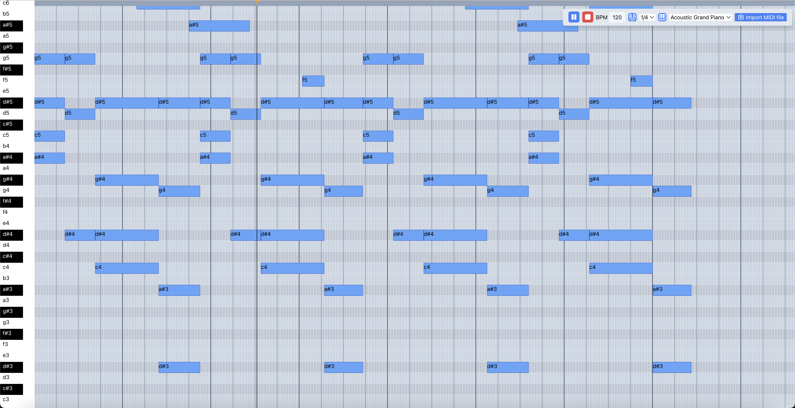

# Piano Roll

Piano Roll is a dynamic piano roll website made with React.
[pianoroll.netlify.app/](pianoroll.netlify.app/)

## Features

-   128 different instruments to select from.
-   Import MIDI files.
-   Export to WAV, MP3, and MIDI formats **(not yet available)**
-   A comprehensive suite of keyboard shortcuts, providing quick and efficient operations.

## Keyboard Shortcuts

### Note Management

-   **Place Note:** Left Mouse
-   **Delete Note:** Right Mouse
-   **Delete All Notes:** Delete
-   **Select Notes:** Ctrl/Cmd + Left Mouse Button
-   **Duplicate Note(s) to Next Bar:** Ctrl/Cmd + B
-   **Duplicate Selected Note(s):** Ctrl/Cmd + Left Mouse (While Selecting Note(s))
-   **Copy Note(s):** Ctrl/Cmd + C
-   **Paste Note(s):** Ctrl/Cmd + V
-   **Cut Note(s):** Ctrl/Cmd + X
-   **Select All Notes:** Ctrl/Cmd + A
-   **Deselect All Note(s):** Ctrl/Cmd + D

### Note Navigation

-   **Move Selected Note Up:** Arrow Up
-   **Move Selected Note Down:** Arrow Down
-   **Move Selected Note Right:** Arrow Right
-   **Move Selected Note Left:** Arrow Left

### Playback

-   **Play/Stop:** Spacebar

### Undo and Redo

-   **Undo:** Ctrl/Cmd + Z
-   **Redo:** Ctrl/Cmd + Y

### View

-   **Zoom Out:** Ctrl/Cmd + -
-   **Zoom In:** Ctrl/Cmd + +
